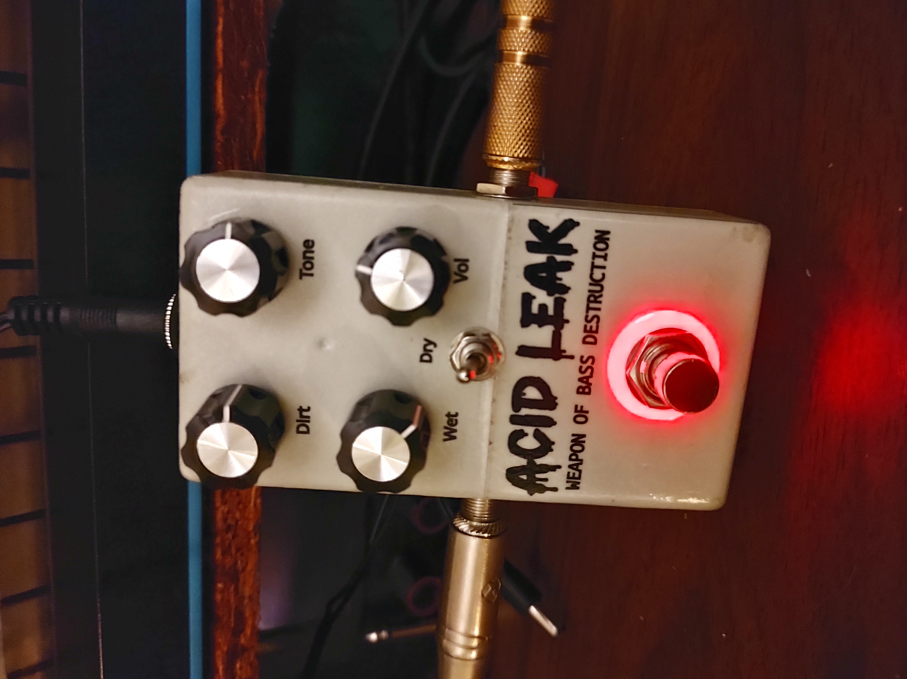
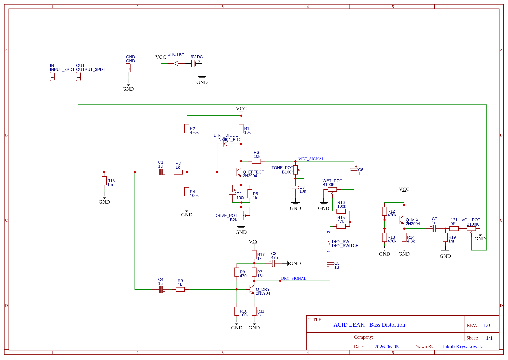
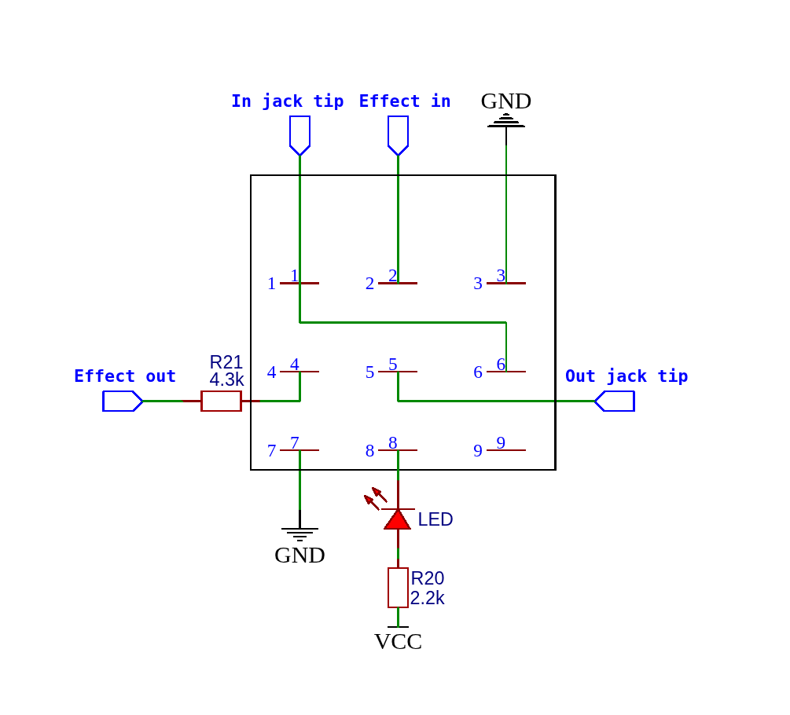

# What is Acid Leak?

Acid Leak is a transistor-based bass distortion designed to create synth-like saturation without sacrificing low frequencies.

Its unique transistor feedback clipping stage produces a dynamic, rounded square-wave character that sits somewhere between overdrive, fuzz and analog synthesizer.

# Demo

# Schematic

## EasyEDA Source

[Download EasyEDA schematic](SCH_Acid-Leak_2026-06-14.json)

## Footswitch wiring (3PDT)

# Design Notes

## Drive Stage

Most distortion, fuzz and overdrive circuits intentionally cut low frequencies before the drive stage to keep the sound tighter and more controlled.

For Acid Leak I wanted the low frequencies to be distorted as well, similar to the way synthesizers generate square waves across the entire frequency range.

I experimented with several high-pass filters before the drive stage, but every attempt removed an important part of the character and low-end response of the effect. For that reason there is no intentional bass-cut filter before the drive transistor.

## DIRT DIODE

The DIRT DIODE is the heart of the effect.

Instead of using typical clipping diodes connected to ground, Acid Leak uses the base-collector junction of a 2N3904 transistor in the collector-base feedback path of the drive stage.

After testing various diodes (1N-series, LEDs and others), this solution produced the most interesting and musical results.

The DIRT DIODE dynamically reduces the gain of the drive transistor and limits the waveform in a softer way than traditional clipping circuits. The result is a rounded square-wave character rather than a harsh fuzz-like clipping.

The following low-pass filter smooths the waveform even further.

## Emitter Bypass Capacitor (C2)

The value of C2 may appear unusually large.

Many different capacitor values were tested, and 100 µF consistently produced the strongest low-end response and the overall sound character I was looking for.

This choice was made entirely by ear.

## Dry Signal Path

The dry signal path provides approximately 5× voltage gain.

The resulting signal is not laboratory-clean, but that is intentional. A slightly coloured dry path blends better with the distorted signal and helps create the characteristic Acid Leak sound.

## Mixer

The mixer is not designed to be a perfectly transparent dry/wet blend.

The wet signal path influences the dry path to some extent, but this behaviour contributes to the final character of the effect. The goal was not technical perfection but a consistent and musical sound.

## Dry Switch

Instead of a dry level control, Acid Leak uses a simple dry signal kill switch.

This provides two distinctly different voices:

Dry ON – fuller sound, more body and low-end support.

Dry OFF – more focused, synth-like and aggressive character.

## Design Philosophy

Acid Leak was developed through listening tests rather than mathematical optimisation.

Many component values may look unconventional, but they were chosen because they produced the sound I wanted to achieve: a bass distortion that retains low frequencies, creates synth-like waveforms and responds musically to playing dynamics.

